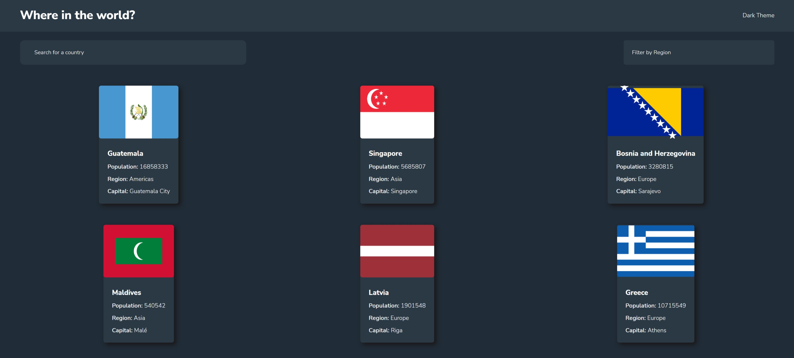
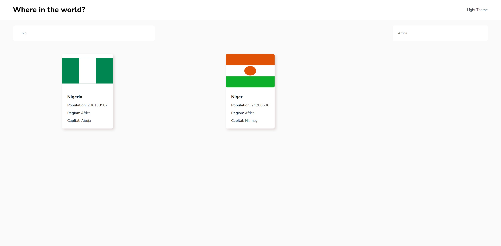
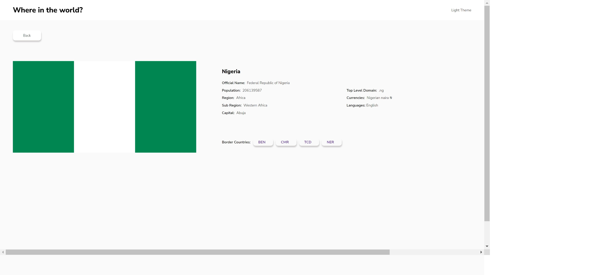

## Overview

### The challenge

Your challenge is to integrate with the [REST Countries API](https://restcountries.com) to pull country data and display it like in the designs.

You can use any JavaScript framework/library on the front-end such as [React](https://reactjs.org) or [Vue](https://vuejs.org). You also have complete control over which packages you use to do things like make HTTP requests or style your project.

Your users should be able to:

- See all countries from the API on the homepage
- Search for a country using an `input` field
- Filter countries by region
- Click on a country to see more detailed information on a separate page
- Click through to the border countries on the detail page
- Toggle the color scheme between light and dark mode *(optional)*

### Links

 - Live Site: 

### Screenshots

## My Process

### Built with
- Vite
- [React](https://reactjs.org/)
- [REST Countries API](https://restcountries.com)
- [React-Router](https://v5.reactrouter.com/)
- [Redux](https://redux-toolkit.js.org/)
- [CSS](https://developer.mozilla.org/en-US/docs/Web/CSS)
- `data.json` For default data if the Api ever goes down

## Built By Chukwuebuka Victor Ezeocha
